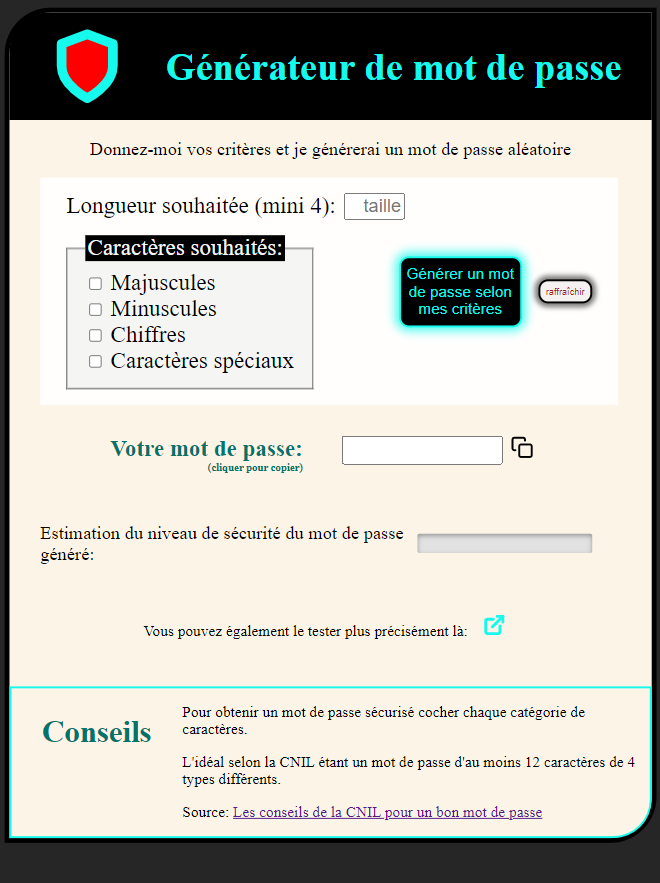
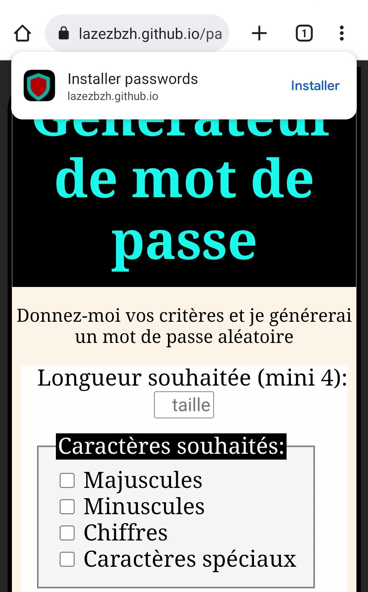
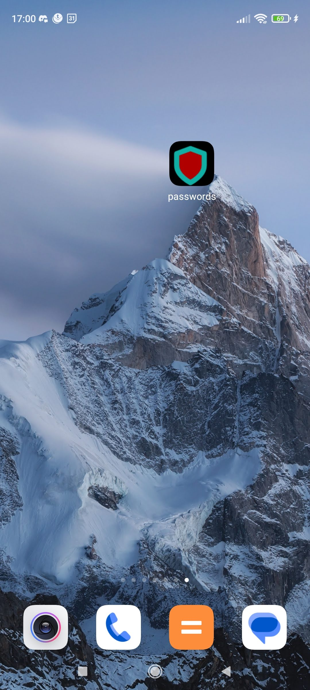

# Projet personnel: générateur de mot de passe

But principal: garder la main et continuer à s'entraîner en vanilla js, découvrir les pwa.

## Table of contents

- [Outils existants déjà](#existant)
  - [Google](#google)
  - [Déjà développés](#other)
- [Mon but](#but)
- [Réalisation](#process)
  - [Technos](#techno)
  - [Problèmes résolus](#problems)
  - [Autres caractéristiques](#features)
- [Author](#author)

## Outils existants déjà

### Google

Si on surfe sur Chrome, il nous propose de générer automatiquement un mot de passe sécurisé.

### Déjà développés

- On trouve de nombreux projets semblable, je ne suis pas la seule à avoir choisi cette thématique pour m'entraîner!

- J'ai cependant remarqué certains problèmes dans les applis que j'ai consultées, par exemple pour lorsque l'on demande de générer un mot de passe de 4 caractères en sélectionnant les 4 types de caractères les mini applis que j'ai trouvées considèrent que sélectionner un type de caractère signifie mot "peut" contenir ce type et non pas "doit", j'ai donc codé mon appli de manière à ce que si un type de caractère est sélectionné le mot généré contiendra au moins un caractère de ce type.

### Mon but

- Coder un générateur de mot de passe contenant au moins un caractère de chaque type sélectionné.
- Créer ma première PWA (progressive web app)

## Réalisation

### Technos

- HTML5
- CSS
- Flexbox
- Javascript vanilla

### Problèmes résolus

- La fonction "generate" a été codée de manière détailler afin que dans chaque cas de figure les types de caractères sélectionnés soient présents: sélection aléatoire en premier d'un caractère de chacun des types sélectionnés, sélection aléatoire pour les autres parmi tous les types de caractères choisis et on mélange le tout pour ne pas avoir à chaque fois des mots de passe commençant toujours par le même type de caractère.

### Autres caractéristiques

- Création d'une petite réglette estimant le niveau de sécurité du mot de passe généré (choix personnel du poids de chaque critère pour l'exercice je ne garantis pas l'exactitude).
- Messages d'erreurs si les champs ne sont pas correctement renseignés.
- Possibilité de copier dans le presse papier le mot de passe généré.
- Responsive
- Accessibilité: Contrast Ratio: 8.59:1
- PWA l'application peut être installée l'écran d'accueil d'un mobile. Utilisation d'un Service Worker.

## Author

- Website - [Bénédicte Hérault](https://lazez-bzh.netlify.app/)
- LinkedIn - [B. HÉRAULT](https://www.linkedin.com/in/benedicte-herault/)
